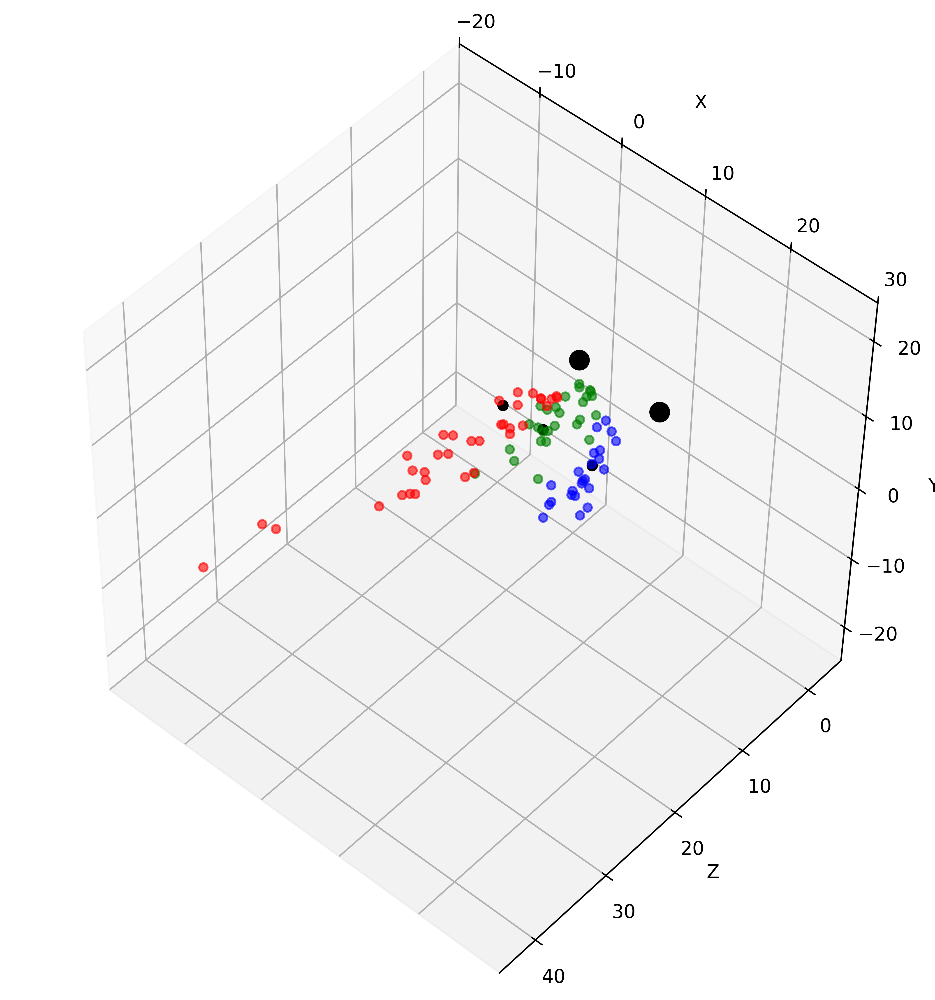
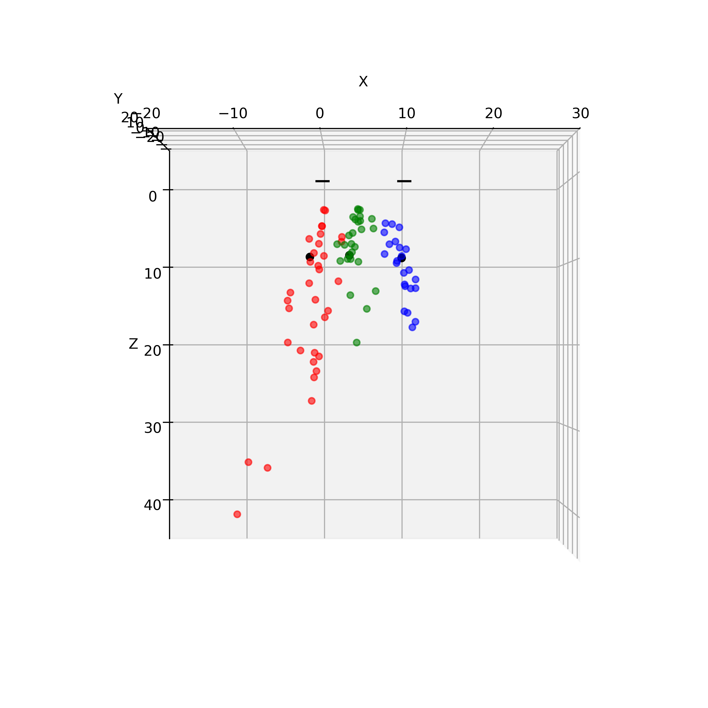
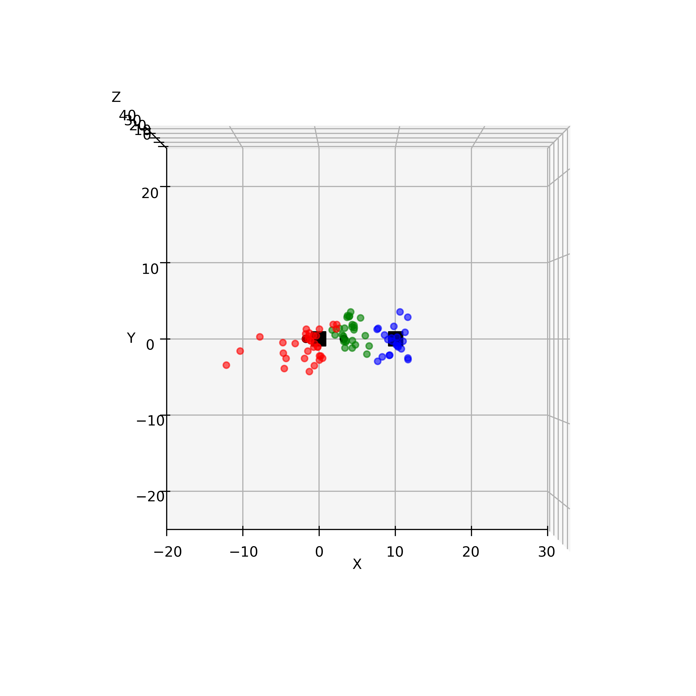

# 2025-04-24 Skaarlia tunnel experiment

BLE AoD positioning proof of concept demonstration.

## Tests

### Test 1
- 11.27 meters distance from beacon 1 (10, 0, 0).
- 9.64 meters distance from beacon 3 (0, 0, 0).
- Ground truth: (3.30, 0, 9.06) in meters.
- Mean positioning error: 1.64 meters.

### Test 2
- 9.4 meters distance from beacon 1 (10, 0, 0).
- 13.5 meters distance from beacon 3 (0, 0, 0).
- Ground truth: (9.69, 0, 9.40) in meters.
- Mean positioning error: 1.27 meters.

### Test 3
- 14.8 meters distance from beacon 1 (10, 0, 0).
- 9.4 meters distance from beacon 3 (0, 0, 0).
- Ground truth: (-1.53, 0, 9.27) in meters.
- Mean positioning error: 6.21 meters.

## Scatter plots

### Scatter plot

### Scatter plot (above)

### Scatter plot (front)

## Beacons

### Beacon 1
- Serial number: 1050638918
- MAC address: F6:66:CD:FD:DC:EB
- Position: (x=10, y=0, z=0) in meters.

### Beacon 3
- Serial number: 685689749
- MAC address: D5:55:32:1F:94:9F
- Position: (x=0, y=0, z=0) in meters.
